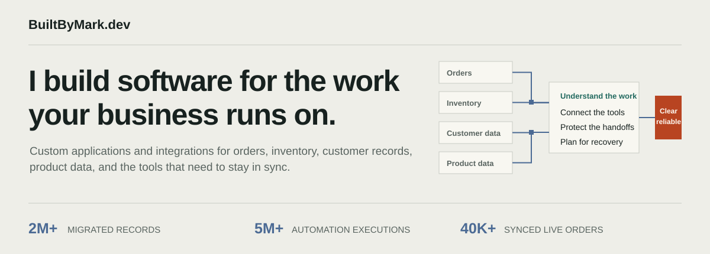
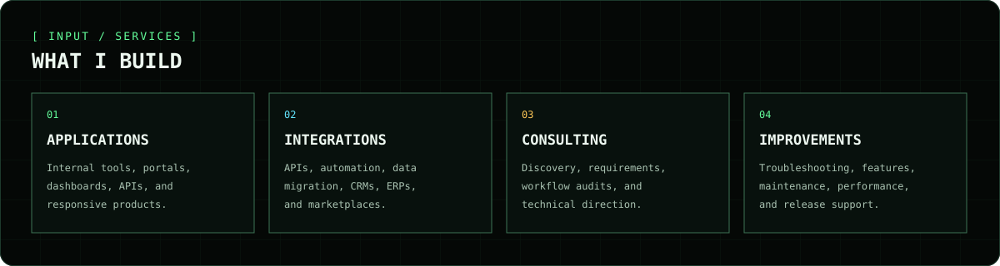
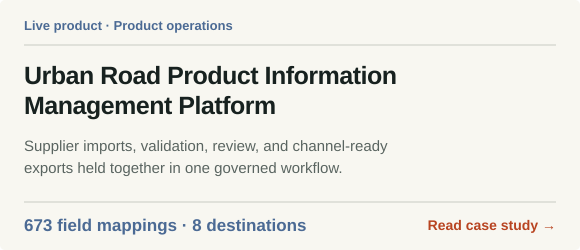
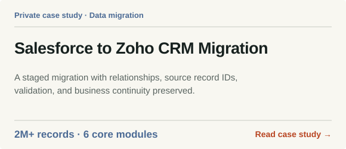
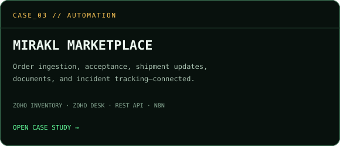
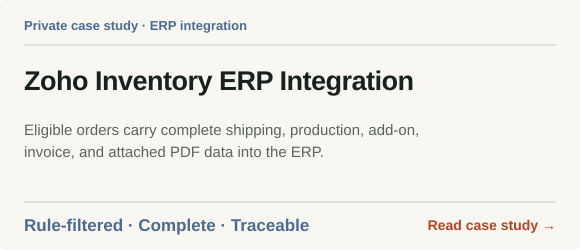
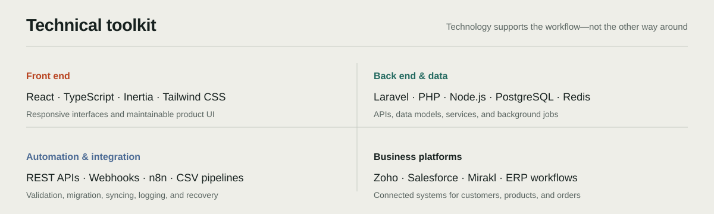

<picture>
  
</picture>

<p align="center">
  <a href="https://builtbymark.dev"><strong>PORTFOLIO</strong></a>
  &nbsp;·&nbsp;
  <a href="https://www.linkedin.com/in/markjudaya/"><strong>LINKEDIN</strong></a>
  &nbsp;·&nbsp;
  <a href="mailto:markjosephjudaya@gmail.com"><strong>EMAIL</strong></a>
  &nbsp;·&nbsp;
  <a href="https://calendar.app.google/MtqQgN54P647GRcx7"><strong>BOOK A CALL</strong></a>
</p>

I work where business workflows and software implementation meet. I help
businesses understand a technical problem, shape a practical solution, build
it, and keep it useful as the work evolves.

My work spans front-end interfaces, back-end services, data models, background
jobs, APIs, automation, and the business platforms that teams rely on every
day.

## What I build



## Selected work

<p align="center">
  <a href="https://builtbymark.dev/projects/urban-road-pim"></a>
  <a href="https://builtbymark.dev/projects/salesforce-to-zoho-crm-migration"></a>
  <a href="https://builtbymark.dev/projects/mirakl-zoho-inventory-integration"></a>
  <a href="https://builtbymark.dev/projects/zoho-inventory-erp-integration"></a>
</p>

## Technical toolkit



## How I work

```text
01  CLARIFY FIRST
    Make the goal, users, constraints, handoffs, and edge cases explicit.

02  DESIGN FOR OPERATIONS
    Build in validation, recovery, auditability, and ownership after launch.

03  BUILD FOR CHANGE
    Use maintainable structure and documentation so the next improvement
    does not require starting again.
```

## Start a conversation

If your team needs a custom application, an integration, an automation
workflow, or help improving an existing system:

- Explore my work at [builtbymark.dev](https://builtbymark.dev).
- Connect with me on [LinkedIn](https://www.linkedin.com/in/markjudaya/).
- Email me at [markjosephjudaya@gmail.com](mailto:markjosephjudaya@gmail.com).
- [Schedule a conversation](https://calendar.app.google/MtqQgN54P647GRcx7).

<details>
<summary><strong>Run this portfolio locally</strong></summary>

```bash
npm install
npm run dev
```

Quality checks:

```bash
npm run format:check
npm run lint
npm run typecheck
npm run build
```

The production build creates the Vite bundle and prerenders the primary routes
and project case studies into `dist/`.

</details>
