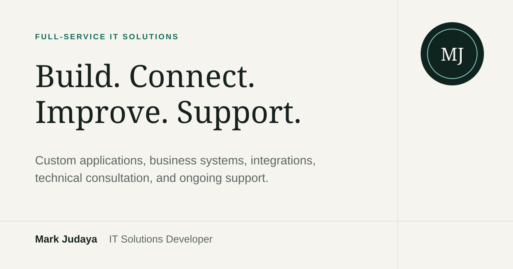

<picture>
  
</picture>

<p align="center">
  <a href="https://builtbymark.dev"><strong>PORTFOLIO</strong></a>
  &nbsp;·&nbsp;
  <a href="https://www.linkedin.com/in/markjudaya/"><strong>LINKEDIN</strong></a>
  &nbsp;·&nbsp;
  <a href="mailto:markjosephjudaya@gmail.com"><strong>EMAIL</strong></a>
</p>

I am a full-stack developer and IT solutions specialist in Cebu, Philippines. I turn complicated operational workflows into dependable custom applications, integrations, automation, and business systems.

My work spans front-end interfaces, back-end services, data models, background jobs, APIs, CRM and inventory platforms, migrations, and production support. The common thread is making the operation clear enough to run, inspect, maintain, and improve.

## Selected work

- [Urban Road Product Information Management Platform](https://builtbymark.dev/projects/urban-road-pim) — governed catalogue, validation, review, and channel-ready exports.
- [Salesforce to Zoho CRM Migration](https://builtbymark.dev/projects/salesforce-to-zoho-crm-migration) — more than 2 million records moved with relationships and traceability.
- [Mirakl Marketplace Integration](https://builtbymark.dev/projects/mirakl-zoho-inventory-integration) — connected order, shipment, document, and incident workflows.
- [Zoho Inventory ERP Integration](https://builtbymark.dev/projects/zoho-inventory-erp-integration) — automated fulfilment, production, shipping, add-on, and invoice data.

## How I work

1. Trace the real workflow and its constraints.
2. Design validation, duplicate protection, logging, recovery, and ownership.
3. Build the interface, data, APIs, and background work as one maintainable system.
4. Support and improve the system after launch.

## Run locally

```bash
npm install
npm run dev
```

Quality checks:

```bash
npm run format:check
npm run lint
npm run typecheck
npm run build
```

The production build creates the Vite bundle and prerenders the primary routes and project case studies into `dist/`.

The redesign rationale and extension rules are documented in [`docs/portfolio-redesign.md`](./docs/portfolio-redesign.md).
